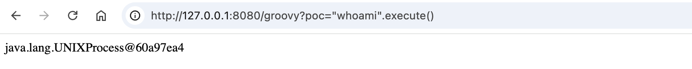
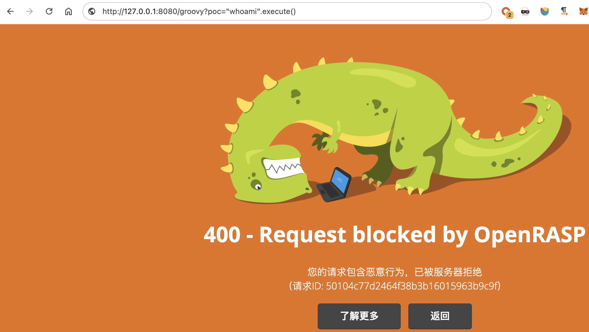
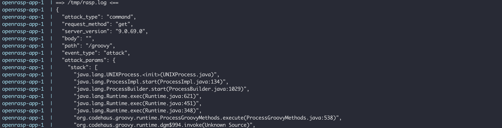
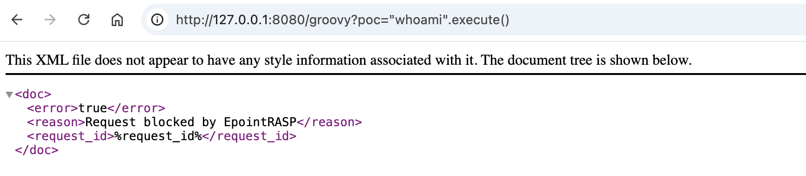
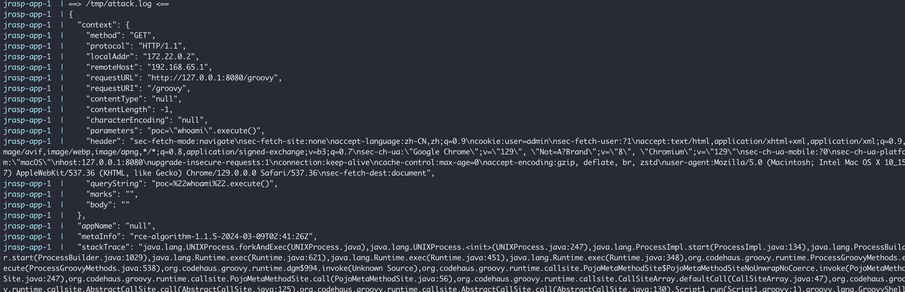
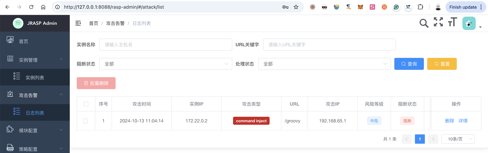
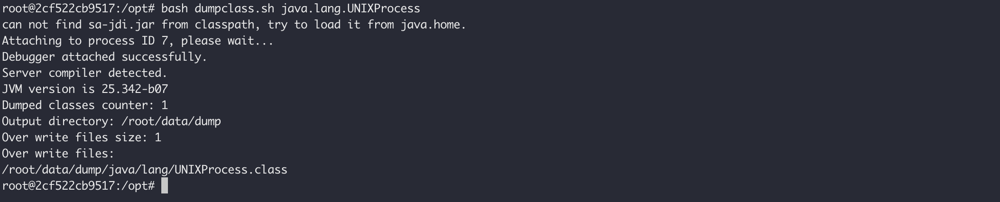
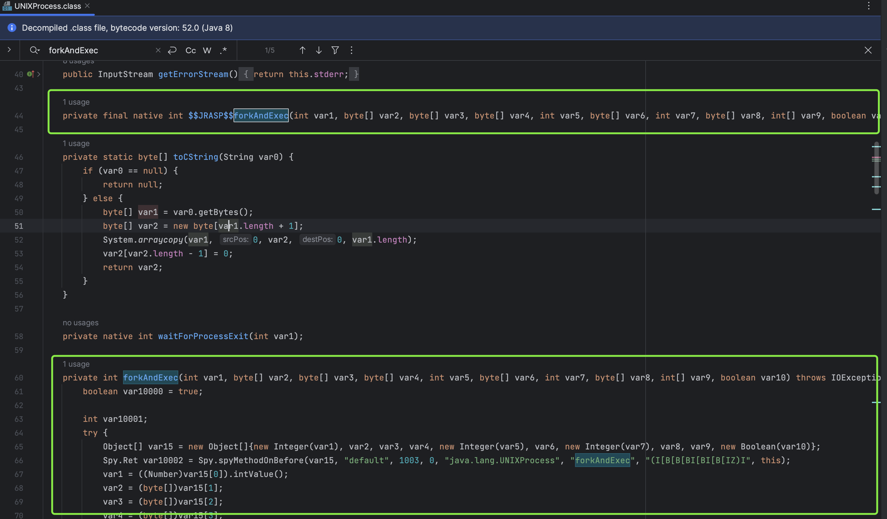

之前研究Java RASP原理和绕过时写了这个Docker项目，主要是为了方便启动带有RASP的Java漏洞环境还有进行各种调试分析。Java Web包含nashorn和groovy代码执行漏洞。RASP包含 jrasp 1.1.5 和 openrasp 1.3.7


#### 启动无RASP的Java Web环境

```
docker compose -f docker-compose-app.yml up --build
```




#### 启动带有openrasp的Java Web环境


```
docker compose -f docker-compose-openrasp.yml up --build
```

配置文件在`./volumes/openrasp/official.js`，已经略作修改。原始配置文件在`./volumes/openrasp/official-raw.js`



标准输出已经对openrasp的拦截日志做了处理和展示，可以直接看到格式化后的拦截日志和堆栈：




#### 启动带有jrasp的Java Web环境

```
docker compose -f docker-compose-jrasp.yml up --build
```

PS. 启动需要等待一分钟左右，jrasp才会注入进程

配置文件在`./volumes/jrasp/config.json`



标准输出已经对jrasp的拦截日志做了处理和展示，可以直接看到格式化后的拦截日志和堆栈



也可以进入后台看日志：




#### Dump Class

众所周知目前Java RASP实现原理之一就是通过Instrumentation API修改Java字节码以达到Hook的目的，那么想知道被RASP Hook之后的类是怎样的，最方便莫过于动态Dump出来：

进入jrasp-app容器`/opt`目录，运行以下命令即可Dump UNIXProcess类，会保存在`./volumes/jrasp/data`目录

```
bash dumpclass.sh java.lang.UNIXProcess
```



这里也可以看出jrasp是通过setNativeMethodPrefix给原本的forkAndExec加了前缀，然后自己实现了一个forkAndExec以达到Hook的目的：


